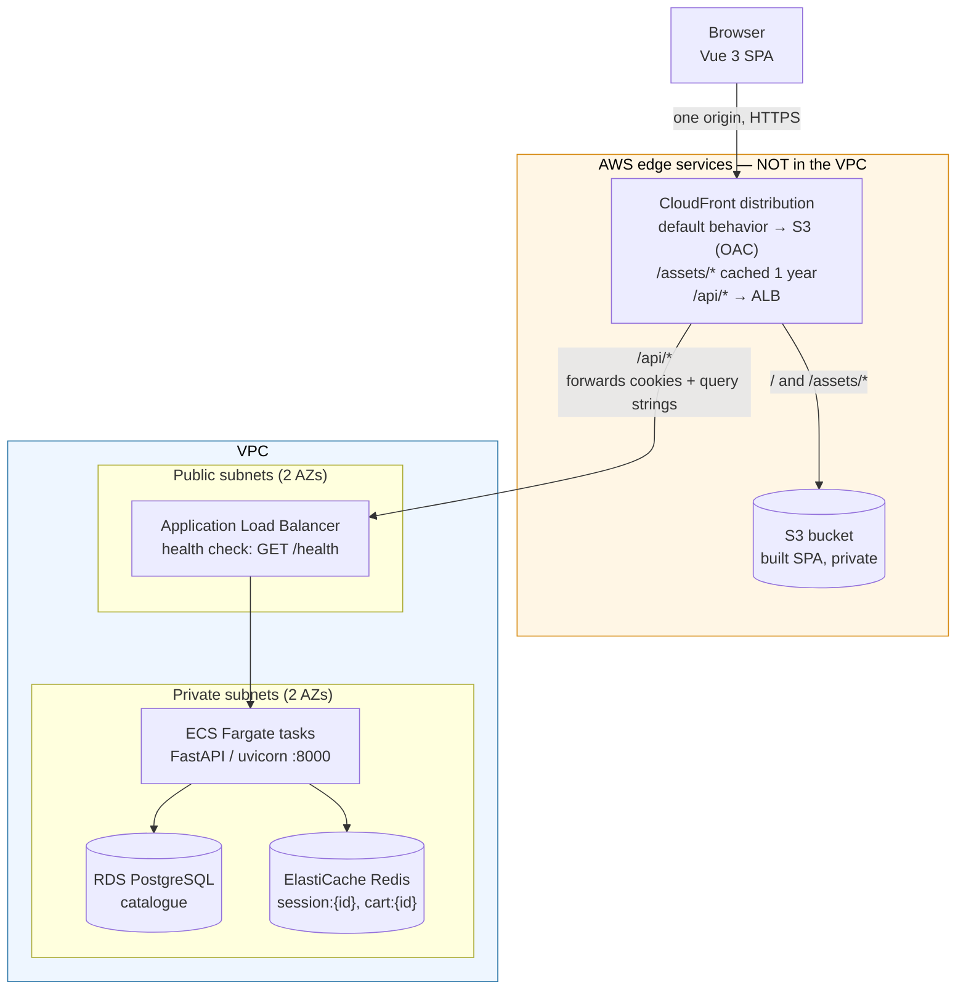
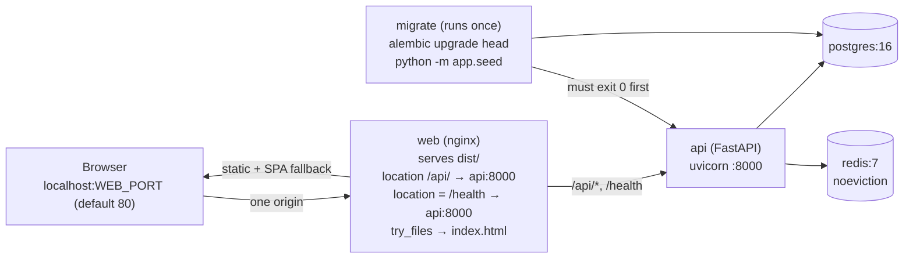
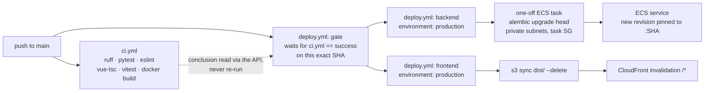

# Architecture

Three tiers — an SPA, a stateless API, and two data stores — arranged so the browser
only ever talks to **one origin**.

## The intended production shape



Two things the diagram is drawn to make unmissable:

**1. `/api/*` is a path on the SPA's own origin, not a separate domain.** CloudFront
routes it to the ALB with cookies and query strings forwarded, so as far as the browser
is concerned there is one host. That is not cosmetic: it is what allows the anonymous
session cookie to stay `SameSite=Lax`. An `api.example.com` subdomain would make every
Cart request cross-site and force the cookie down to `SameSite=None`, which is a
strictly weaker position — and would drag in credentialed CORS on every request rather
than only in local development. The reasoning is in
[ADR-001](adr/ADR-001-server-owned-cart.md); the consequence is restated in
[ADR-003](adr/ADR-003-managed-aws-data-tier.md).

**2. S3 and CloudFront are edge services and are not in the VPC.** Only ECS, RDS and
ElastiCache sit inside the network boundary; RDS and ElastiCache are in private subnets
reachable only from the ECS task security group, never from the internet. There is no
security group you can attach to CloudFront, and no subnet an S3 bucket lives in — so
"lock the data tier down to the VPC" and "serve the SPA from the edge" are two different
mechanisms, not one.

## The same shape locally

`docker compose up` reproduces it with nginx standing in for
CloudFront:



nginx does **not** strip the `/api` prefix — the API owns that namespace itself, so
`location /api/ { proxy_pass http://api:8000; }` passes the path through unchanged. The
`dev` profile swaps nginx for the Vite dev server, whose `server.proxy` does the same job
for `/api` and `/health`; either way the browser sees a single origin and the cookie
stays `Lax`.

## Inside the API

- **Route handlers are thin.** They translate HTTP to domain calls and domain errors to
  status codes, and nothing else.
- **Repositories are Protocols, not classes.** `ProductRepository` and `CartRepository`
  are structural types in `app/domain/repositories.py`. `app/main.py` binds one
  provider — `get_product_repository` — for both the catalogue and the Cart routers, so
  a `productId` from a listing always resolves through the same repository the Cart uses.
  Tests swap in `InMemoryRepository` through the same seam.
- **The Cart is server-owned.** Redis holds `cart:{sessionId}` as `{productId: quantity}`
  and nothing else — no name, no price, no currency. Every response re-resolves each line
  against the catalogue, which is why a price change is visible immediately and a stale
  price is impossible to serve.
- **Sessions slide.** `session:{id}` and `cart:{id}` both get their TTL refreshed on read
  as well as write, so a Shopper who is only looking at their Cart does not have it
  expire underneath them. A Redis outage degrades cookie issuance to a logged no-op
  rather than a failed request.
- **Middleware order is load-bearing.** `add_middleware` prepends, so the last one added
  is outermost: `CORSMiddleware` is added last so error responses still pass out through
  it, and `SessionCookieMiddleware` sits outside `RequestIdMiddleware` so a request that
  fails still gets its session cookie.
- **Logs are structured JSON** with an `X-Request-Id` on every line and every response,
  so a browser-side failure can be joined to the server log that explains it. The session
  token is deliberately never logged — it is a bearer credential.

## Where the code lives

```
backend/app/
  main.py            FastAPI app, middleware order, router wiring
  api/               HTTP routes: products.py, cart.py, deps.py, providers.py
  domain/            Frozen dataclasses, repository Protocols, errors, fakes
  repositories/      SqlProductRepository (Postgres), RedisCartRepository
  db/                SQLAlchemy models and session
  models.py          Pydantic wire schemas (camelCase aliases)
  session.py         Anonymous session cookie + Redis-backed record
  settings.py        Environment configuration
  seed.py            Idempotent catalogue seed
backend/alembic/     Migrations (shipped in the runtime image)

frontend/src/
  api/client.ts      The only place fetch is called
  stores/            Pinia: catalogue, cart
  components/        CataloguePage, ProductDetailPage, CartPage, …
  router/            /, /products/:id, /cart, catch-all

infra/
  app.py             CDK app; stacks are <env>-network|data|ecr|backend|frontend|deploy
  stacks/            network, data, ecr, backend, frontend, deploy
  config/            staging.py, prod.py

scripts/
  deploy-to-aws.sh   Stand an environment up from nothing, in one command
  destroy-aws.sh     cdk destroy in reverse order, behind a typed confirmation

.github/workflows/
  ci.yml             The test gate: ruff, pytest, eslint, vue-tsc, vitest, image builds
  deploy.yml         Deploy on merge to main (ADR-004)
```

`ecr` is a stack of its own — one repository and two outputs — because the backend's task
definitions pull `<repo>:latest` and that tag has to exist *before* the ECS service tries
to start. Registry, then image, then everything that consumes the image;
`scripts/deploy-to-aws.sh` walks that order.

## How a merge reaches production



Three things the diagram is drawn to make unmissable:

**1. The test suite runs once.** `deploy.yml` reads `ci.yml`'s conclusion for the same
commit instead of re-running it. CodePipeline could not do this — it had no view of
GitHub's checks — so it paid for a second copy of the gate. [ADR-004](adr/ADR-004-github-actions-over-codepipeline.md).

**2. Backend and frontend never wait on each other.** Two jobs off the same gate, no
`needs` between them.

**3. The migration runs inside the VPC; the runner does not.** RDS admits only the ECS
task security group, and a GitHub-hosted runner is on the public internet — so
`alembic upgrade head` runs as a one-off Fargate task from the image being deployed, and
the service is updated only if that container exited `0`. This is the same shape as
`migrate` in the local Compose stack.

## Gap between this diagram and what is deployable today

The upper diagram is the target. What `cdk synth` currently produces differs, and the
differences are real:

- **There is no data stack**, so no RDS or ElastiCache is created and the ECS task
  definition sets no `DATABASE_URL` or `REDIS_URL` — the container would fall back to its
  `localhost` defaults. `/health` would still answer `200`, because it touches neither
  store.
- **The ALB listener is HTTP on port 80**, not HTTPS on 443, pending an ACM certificate
  and a real domain. The CloudFront `/api/*` behavior follows it over plain HTTP
  (`alb_listener_protocol` in `infra/config/`), so the CloudFront → ALB hop crosses the
  AWS network without TLS and the session cookie rides it in the clear.
- **There is no custom domain.** `custom_domain_enabled` is `False`, so no ACM
  certificate and no Route 53 alias are created and the distribution serves on its
  generated `*.cloudfront.net` name. The single-origin property is unaffected — one
  CloudFront host still serves both the SPA and `/api/*` — but the host is not the
  branded one.

The `/api/*` behavior itself **is** implemented (INF-06): it routes to the ALB with
`CachingDisabled` + `AllViewer`, so cookies and query strings reach the API, and it
allows the write methods the Cart needs. The SPA-routing rewrite is a CloudFront Function
scoped to the S3 behaviors rather than a distribution-wide `error_responses` entry,
precisely so an API `404` stays an API `404` instead of coming back as the SPA shell.

See [the runbook](runbook.md) for the full state-of-play and what has to change before a
deploy can succeed.
