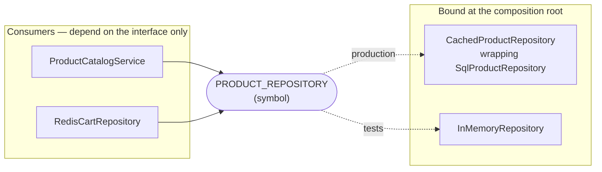
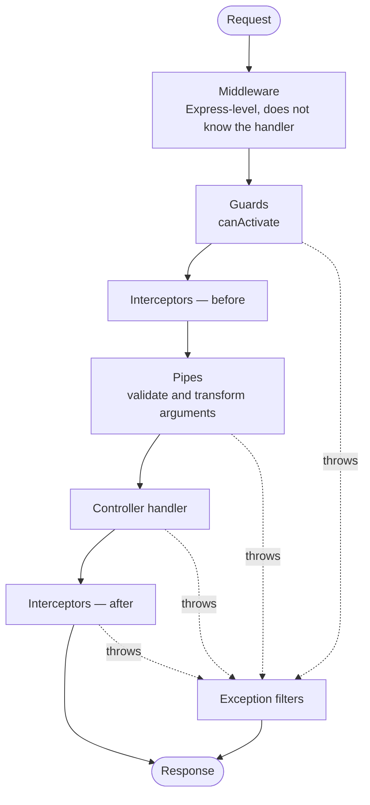
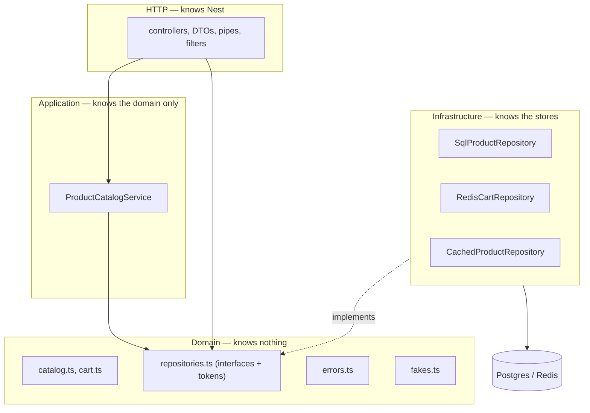

# NestJS Fundamentals — explained through this codebase

Every concept below is followed by the place in `backend_js/src` where this project actually
uses it, and the rule that follows from it. The conventions are the ones in
[`docs/coding-instructions.md`](coding-instructions.md); where this file says "the rule",
that's what it's referring to.

> **🐍 FastAPI** call-outs appear throughout. This repository is unusual in that it contains
> **the same API implemented twice** — `backend/` in Python/FastAPI and `backend_js/` in
> NestJS/TypeScript, serving byte-identical responses. That makes the comparison unusually
> concrete: the call-outs point at the *same feature* in the other language, so you can read both
> and see which parts of Nest are essential ideas and which are just Nest's spelling of them.
> Section 19 collects everything into one translation table.

Section 18 is a list of **real defects and rough edges in `backend_js` as it stands today**,
found while writing this document. They are described, not fixed.

**Contents**

1. [The mental model](#1-the-mental-model)
2. [Bootstrapping — the composition root](#2-bootstrapping--the-composition-root)
3. [Modules](#3-modules)
4. [Providers and dependency injection](#4-providers-and-dependency-injection)
5. [Controllers](#5-controllers)
6. [DTOs, pipes, and validation](#6-dtos-pipes-and-validation)
7. [The request lifecycle](#7-the-request-lifecycle)
8. [Middleware vs guards vs interceptors](#8-middleware-vs-guards-vs-interceptors)
9. [Exception filters](#9-exception-filters)
10. [Persistence with TypeORM](#10-persistence-with-typeorm)
11. [Keeping Nest out of your domain](#11-keeping-nest-out-of-your-domain)
12. [Configuration](#12-configuration)
13. [Logging](#13-logging)
14. [Lifecycle hooks and graceful shutdown](#14-lifecycle-hooks-and-graceful-shutdown)
15. [Testing](#15-testing)
16. [Tooling](#16-tooling)
17. [Anti-pattern checklist](#17-anti-pattern-checklist)
18. [Known rough edges in this codebase](#18-known-rough-edges-in-this-codebase)
19. [NestJS ↔ FastAPI translation table](#19-nestjs--fastapi-translation-table)

---

## 1. The mental model

Nest is **two things wearing one coat**:

1. A **dependency-injection container** that builds an object graph at startup from class
   metadata, and
2. A **thin, decorator-driven layer over Express** (or Fastify) that turns HTTP requests into
   method calls on objects from that graph.

Almost every "how do I…" question in Nest resolves to one of those two. If it's about *what
object do I get*, it's the container. If it's about *when does my code run relative to the
request*, it's the lifecycle in [section 7](#7-the-request-lifecycle).

```mermaid
flowchart TB
    subgraph startup["Startup — happens once"]
        mods["Modules declare providers"] --> graph["DI container instantiates the graph"]
        graph --> routes["Routes registered from @Controller/@Get metadata"]
    end
    subgraph request["Per request"]
        http["HTTP request"] --> mw["middleware"] --> guard["guards"] --> intr["interceptors"]
        intr --> pipe["pipes"] --> handler["controller method"]
        handler --> svc["services from the graph"]
        svc --> repo["repositories"]
        repo --> stores[("Postgres / Redis")]
    end
    routes -.-> http
```

The decorators are not magic; they write metadata onto the class with `reflect-metadata`, which is
why `import 'reflect-metadata'` is the first line of both `src/main.ts` and `src/data-source.ts`,
and why `emitDecoratorMetadata: true` is in `tsconfig.json`. Remove either and constructor
injection stops working, usually with a confusing "Nest can't resolve dependencies" error.

**The single most useful debugging question in Nest is: *"which module provides this token, and is
that module in scope where I'm injecting it?"*** Nearly every startup failure is a provider that
exists but isn't exported, or is exported but its module isn't imported.

> **🐍 FastAPI:** the opposite arrangement. FastAPI has no container — `Depends()` is a *call
> graph* resolved per request, not an object graph built at startup. `backend/app/api/deps.py`
> is a plain generator function; Nest's equivalent, `RepositoriesModule`, is a class whose
> metadata the container reads. The trade: FastAPI's model is simpler to trace (follow the
> function calls) and re-resolves per request by default; Nest's is singleton-by-default, so a
> repository is built once and shared, and swapping one for a test is a container-level override
> rather than a dictionary assignment (`app.dependency_overrides[...]`).

---

## 2. Bootstrapping — the composition root

`src/main.ts` is the entire composition root — the one place that knows the app is HTTP, is
Express, and has these globals. Everything else in `src/` is ignorant of it.

```ts
export async function bootstrap(): Promise<void> {
  const app = await NestFactory.create(AppModule, { logger: new JsonLogger('nest') })

  app.enableCors({ origin: [...settings.allowedOrigins], credentials: true, /* … */ })

  app.use(sessionCookieMiddleware)
  app.use(requestIdMiddleware)

  app.useGlobalPipes(new ValidationPipe({ transform: true, errorHttpStatusCode: 422 }))
  app.useGlobalFilters(new AllExceptionsFilter())

  app.enableShutdownHooks()

  await app.listen(PORT, '0.0.0.0')
}
```

Four things worth noticing, because each is a decision rather than boilerplate:

**Order is the contract.** CORS is registered first and is therefore outermost, so an error
response produced deep inside still passes back out through it. Registered the other way round, a
500 reaches the browser stripped of its CORS headers and the SPA sees an opaque network failure it
cannot distinguish from an unreachable server. `test/error-handling.spec.ts` asserts exactly this.

**`bootstrap` is exported and guarded.** The bottom of the file is:

```ts
if (require.main === module) {
  void bootstrap()
}
```

so importing `main.ts` doesn't start a server. That is what lets a future test import it.

**`listen(PORT, '0.0.0.0')`.** The default host binds to localhost only, which works on your
laptop and then fails silently in a container — the port is published and nothing answers. Always
bind `0.0.0.0` in a container.

**`enableShutdownHooks()`.** Without it, `onApplicationShutdown` never fires on `SIGTERM`, which
is how ECS stops a task — so the Redis socket would never close cleanly. See
[section 14](#14-lifecycle-hooks-and-graceful-shutdown).

> **🐍 FastAPI:** `backend/app/main.py` is the same file with the same job, and the same ordering
> hazard stated in a comment there: `add_middleware` **prepends**, so the *last* middleware added
> is the *outermost*. Nest's `app.use()` appends, so the *first* is outermost. The two files
> arrive at the same layering by writing the list in opposite orders — a good example of why
> "copy the structure" is not the same as "copy the lines".

---

## 3. Modules

A module is a **declaration of what exists and who can see it**. It has four fields that matter:

| Field | Means |
|---|---|
| `providers` | Things this module can build |
| `controllers` | Things this module routes to |
| `imports` | Other modules whose **exports** become visible here |
| `exports` | Which of my providers other modules may import |

The one rule that explains most errors: **a provider is private to its module unless exported, and
invisible to another module unless that module imports mine.** `providers` is not a global
registry.

`src/app.module.ts` is the whole graph of this service:

```ts
@Module({
  imports: [
    TypeOrmModule.forRoot(dataSourceOptions()),
    RedisModule,
    RepositoriesModule,
    CatalogModule,
    CartModule,
    HealthModule,
  ],
})
export class AppModule {}
```

Feature modules are deliberately thin. `src/catalog/catalog.module.ts` is six lines:

```ts
@Module({
  controllers: [ProductsController],
  providers: [ProductCatalogService],
})
export class CatalogModule {}
```

It provides no repository — that comes from `RepositoriesModule`, which is `@Global()`.

### `forRoot`, `forFeature`, and dynamic modules

`TypeOrmModule.forRoot(...)` is a **dynamic module**: a static method returning a module
*description* rather than a class. That is Nest's answer to "this module needs configuration". The
convention across the ecosystem:

- `forRoot(config)` — configure once, at the root, for the whole app.
- `forFeature(entities)` — register a slice in a feature module (this project doesn't use it; see
  [section 10](#10-persistence-with-typeorm)).
- `forRootAsync({ useFactory })` — the same, but the config itself needs injection.

This project passes `dataSourceOptions()` — a plain function in `src/db/data-source-options.ts` —
so the app, the migration CLI (`src/data-source.ts`) and the seeder all connect identically. That
is the point of factoring it out: a change to pooling or SSL cannot apply to only one of them.

### `@Global()` — and why it's used twice here

`@Global()` puts a module's exports in scope everywhere without an `imports` entry.
`RedisModule` and `RepositoriesModule` both use it.

The received wisdom is "avoid `@Global()`" and it's good wisdom: it hides the dependency graph, so
you can no longer tell what a module needs by reading its `imports`. The justification here is
narrow and worth stating because it's the kind of judgement you'll have to make:

- There is exactly **one** Redis connection and **one** product repository in the process.
- Both are needed by the catalogue, the cart, *and* health — three of the four feature modules.
- `PRODUCT_REPOSITORY` being a single shared binding is a **correctness requirement**, not a
  convenience: the comment in `src/domain/repositories.ts` records that when the catalogue and the
  cart each owned their own provider in the Python service, they disagreed about what a product id
  even *was* — the catalogue served database primary keys while the cart resolved a slug of the
  product name, so a `productId` copied from a listing 404'd on `POST /api/cart/items`.

**Rule:** reach for `@Global()` only when a provider is genuinely process-wide *and* sharing it is
load-bearing. "Three modules need it" alone is not enough — that's what `imports` is for.

---

## 4. Providers and dependency injection

A provider is anything the container can build. The token — the key it's registered under — can be
a class, a string, or a symbol.

### The four provider shapes

```ts
// 1. useClass (the shorthand: listing the class itself)
providers: [ProductCatalogService]

// 2. useValue — a ready-made object. The test factory uses this to inject fakes.
{ provide: PRODUCT_REPOSITORY, useValue: new InMemoryRepository(products) }

// 3. useFactory — build it yourself, with injected arguments
{
  provide: PRODUCT_REPOSITORY,
  inject: [DataSource, REDIS_CLIENT],
  useFactory: (dataSource: DataSource, redis: Redis): ProductRepository =>
    new CachedProductRepository(new SqlProductRepository(dataSource), redis, settings.cacheTtlSeconds),
}

// 4. useExisting — an alias for another token
{ provide: 'LegacyName', useExisting: PRODUCT_REPOSITORY }
```

### Why this project injects an interface, and how

TypeScript interfaces **do not exist at runtime**. There is no `ProductRepository` value for the
container to key on, so an interface can never be an injection token. The standard solution is a
symbol beside the interface:

```ts
// src/domain/repositories.ts
export const PRODUCT_REPOSITORY = Symbol('ProductRepository')

export interface ProductRepository {
  listProducts(query: ProductQuery): Promise<ProductPage>
  // …
}
```

and `@Inject()` at the point of use, because the type annotation carries no runtime information:

```ts
// src/catalog/product-catalog.service.ts
constructor(
  @Inject(PRODUCT_REPOSITORY) private readonly repository: ProductRepository,
) {}
```

A `Symbol` rather than a string is deliberate: two libraries can both pick `'ProductRepository'`
and silently collide; two symbols never do.

**This is the single most important pattern in the codebase.** It's what lets
`ProductCatalogService` depend on a *contract* while production supplies a Postgres repository
wrapped in a Redis cache, and tests supply an in-memory one, with neither knowing about the other.



### Scopes

Providers are **singletons by default** — built once, shared by every request. That is the right
default and this project uses nothing else. Nest also offers `Scope.REQUEST` (a new instance per
request) and `Scope.TRANSIENT`, but request scope is contagious: anything injecting a
request-scoped provider becomes request-scoped too, all the way up the graph, and the whole chain
is rebuilt per request.

**Rule:** if you're reaching for `Scope.REQUEST` to get at request data, you almost certainly want
a parameter decorator (`@CurrentSession()`) or `AsyncLocalStorage`
(`src/common/request-context.ts`) instead. This project uses both, and has no request-scoped
providers.

> **🐍 FastAPI:** `Depends(get_product_repository)` keys on the *function object*, which is why
> `backend/app/api/providers.py` exists at all — a module whose entire content is one function
> that raises `NotImplementedError`, existing solely to be a stable key that `app.main` overrides.
> Nest's `Symbol` does the same job more honestly: it is obviously a key and nothing else. Note
> the identical reasoning in both files' docstrings — this is the same design, twice.

---

## 5. Controllers

A controller maps routes to methods. It should contain **HTTP concerns and nothing else**.

```ts
// src/catalog/products.controller.ts
@Controller('api')
export class ProductsController {
  constructor(private readonly catalog: ProductCatalogService) {}

  @Get('products')
  async listProducts(@Query() query: ListProductsQuery): Promise<ProductListResponse> { /* … */ }

  @Get('products/:productId')
  async getProduct(@Param('productId') productId: string): Promise<ProductDetailResponse> { /* … */ }
}
```

The `@Controller('api')` prefix and the method's path are concatenated, so these are
`/api/products` and `/api/products/:productId`. `src/cart/cart.controller.ts` uses
`@Controller('api/cart')` with a bare `@Get()`, which is exactly `/api/cart`.

### Return a value; don't touch the response

A handler that returns a value lets Nest serialize it and pick the status code (200, or 201 for
`@Post`). Reaching for `@Res()` opts you out of that entirely — Nest stops serializing and it
becomes your job to end the response.

The one place this project uses `@Res()` shows the escape hatch done properly:

```ts
// src/health/health.controller.ts
@Get('health')
async check(@Res({ passthrough: true }) response: Response): Promise<HealthReport> {
  const report = await this.health.status()
  if (report.status !== STATUS_OK) {
    response.status(HttpStatus.SERVICE_UNAVAILABLE)
  }
  return report
}
```

`passthrough: true` means "let me set a header or status, but you still handle the body". Without
it, that method would return an object into the void and the request would hang.

### Status codes are part of the contract

`@HttpCode(HttpStatus.OK)` appears on every mutating cart route, because Nest's default for
`@Post` is **201** and this API's contract says every cart mutation returns **200 with the whole
cart** — the SPA re-renders from the response body, so a body-less 201 or 204 would force a second
request.

**Rule:** if a status code is part of your API contract, state it with `@HttpCode`. Don't let a
framework default define your contract by accident.

> **🐍 FastAPI:** the mirror image. FastAPI defaults `POST` to 200 and you opt into 201 with
> `status_code=201`; Nest defaults to 201 and you opt out with `@HttpCode(200)`. Same contract,
> opposite defaults — which is precisely the sort of thing that makes two "identical" services
> quietly diverge. It is also why `backend/app/api/cart.py` carries a comment saying there is no
> 201 or 204 anywhere.

---

## 6. DTOs, pipes, and validation

A **pipe** transforms or validates an argument before the handler sees it. `ValidationPipe`
combines `class-transformer` (plain JSON → class instance) with `class-validator` (decorators →
checks).

DTOs must be **classes**, not interfaces — the decorators need a runtime object to attach metadata
to.

```ts
// src/catalog/dto/list-products.query.ts
export class ListProductsQuery {
  @IsOptional() @IsString()  name?: string
  @IsOptional() @IsEnum(SortKey) sort?: SortKey

  @IsOptional() @Type(() => Number) @IsInt() @Min(0) @Max(MAX_PAGE_SIZE)
  limit?: number
}
```

`@Type(() => Number)` is required and easy to forget: **every query parameter arrives as a
string**, so without it `@IsInt()` fails on `?limit=20`.

### The subtle one: global pipes run before parameter pipes

This project needs two different strictnesses, and getting them from one pipe is impossible:

- An unknown **query parameter** must be *ignored* (FastAPI ignores them, and the contract says
  both services behave identically).
- An unknown **body field** must be a **422** — this API never accepts a price from the client, so
  a stray `unitPriceMinor` has to be rejected loudly rather than silently dropped.

The first attempt was `whitelist: true` on the global pipe plus `forbidNonWhitelisted: true` on the
body. It failed, and the reason is worth internalising: **the global pipe runs first**, stripped
`unitPriceMinor`, and the stricter body pipe never saw it. The test went red with a 200 where a
422 was expected.

The fix is in `src/main.ts` and `src/cart/cart.controller.ts`:

```ts
// main.ts — global: transform and 422, but NO whitelist
new ValidationPipe({ transform: true, errorHttpStatusCode: HttpStatus.UNPROCESSABLE_ENTITY })

// cart.controller.ts — bodies only: strict
const bodyPipe = new ValidationPipe({
  transform: true,
  whitelist: true,
  forbidNonWhitelisted: true,
  errorHttpStatusCode: HttpStatus.UNPROCESSABLE_ENTITY,
})
// …
async addItem(@Body(bodyPipe) body: AddCartItemRequest) { /* … */ }
```

`errorHttpStatusCode` appears in both because Nest's default validation failure is **400**, and
this API's contract — inherited from FastAPI's Pydantic layer — is **422**.

**Rule:** pipes compose in the order global → controller → route → parameter, and each receives
the *previous* one's output. If a narrower pipe seems not to fire, check whether a broader one
already ate its input.

### Path parameters that must not be parsed

`@Param('productId') productId: string` is deliberately not `ParseIntPipe`. The contract says
`/api/products/abc` is a **404**, not a 422 — the repository's own contract is to return `null`
for an id that names nothing, and a non-numeric id names nothing. `ParseIntPipe` would answer 400
before the repository was ever asked. The parsing and int4 range check live in
`src/repositories/sql-product.repository.ts::parseProductId` instead, so no invalid id reaches the
driver.

---

## 7. The request lifecycle

This is the diagram to memorise. Nearly every "where should this code go?" question is answered by
it.



Read it twice, because the two facts that matter most are both about what is *outside* what:

1. **Guards run before pipes.** That is why `SessionGuard` resolves a session even for a request
   whose body is about to fail validation — a first-time Shopper whose very first cart call 422s
   still gets a cookie. `test/session.spec.ts` asserts it.
2. **Exception filters are inside middleware.** A filter produces a *new* response object. Any
   header a guard or interceptor staged on the response it never got to send is lost. That single
   fact dictates the whole design of the session cookie — see
   [section 8](#8-middleware-vs-guards-vs-interceptors).

> **🐍 FastAPI:** the same layering with fewer named concepts. Starlette middleware wraps
> everything; `Depends()` covers what Nest splits into guards *and* pipes *and* injection; and
> `@app.exception_handler` is the filter. Nest's finer decomposition costs more vocabulary and
> buys you the ability to apply each piece at a different scope — a guard on one controller, a
> pipe on one parameter — which FastAPI expresses by putting `Depends` in different places.

---

## 8. Middleware vs guards vs interceptors

They overlap enough to be confusing. The honest distinction is **what they can see**:

| | Sees | Can't see | Use it for |
|---|---|---|---|
| **Middleware** | raw `req`/`res` | which handler will run | Express-level concerns: correlation ids, response mutation |
| **Guard** | `ExecutionContext` — handler, class, DI | the parsed body | Deciding whether the request may proceed |
| **Interceptor** | before *and* after, as an RxJS stream | the raw socket write | Wrapping results, timing, caching |
| **Filter** | the thrown error | the successful path | Turning an error into a response |

This project's session handling uses **two of them together**, and the reason is the most
instructive thing in the codebase.

### The problem

The session cookie must be attached to *every* response a cart route can produce: a 200, a 204, a
hand-built response, a 422 from validation, and a 500 from an unhandled throw. Miss the error
cases and a first-time Shopper whose first call fails gets no cookie at all — orphaning the Redis
record and losing their cart on the next request.

### Why the obvious approaches fail

- **In the guard.** A guard can call `res.cookie()`. But if anything downstream throws, the
  exception filter builds a *fresh* response and the staged header is gone.
- **In an interceptor.** An interceptor's `tap` doesn't fire on the error path, and a
  `catchError` still hands off to the filter.

### What it actually does

`SessionGuard` resolves the session and parks it on the request:

```ts
// src/common/session/session.guard.ts
async canActivate(context: ExecutionContext): Promise<boolean> {
  const request = context.switchToHttp().getRequest<RequestWithSession>()
  const sessionId = readSessionCookie(request) ?? mintSessionId()
  request[SESSION_REQUEST_PROPERTY] = sessionId
  await this.store.touch(sessionId)
  return true
}
```

and `sessionCookieMiddleware`, registered *outside* everything, wraps `writeHead` — the single
choke point every Express response passes through, whether it was sent by a controller, by the
validation pipe, or by the exception filter:

```ts
// src/common/session/session.middleware.ts
const originalWriteHead = response.writeHead.bind(response)
response.writeHead = function patchedWriteHead(this: Response, ...args) {
  const sessionId = request[SESSION_REQUEST_PROPERTY]
  if (sessionId !== undefined && !response.headersSent) {
    appendSetCookie(response, serializeSessionCookie(sessionId))
  }
  return originalWriteHead(...args)
} as Response['writeHead']
```

Because only the guard sets that property, and the guard is only on the cart routes, `/health` and
the whole catalogue mint no session and receive no cookie — which `test/products-api.spec.ts`
asserts directly.

Be clear-eyed about this: **it is a monkey-patch**, and monkey-patching a Node internal is a thing
to justify, not a thing to reach for. The justification is that `res.end()` calls `writeHead`
implicitly when nothing called it explicitly, so one wrapper covers every exit path including the
ones no Nest abstraction can reach. It is the same trick Starlette's `BaseHTTPMiddleware` plays
with its send-wrapper, which is what `backend/app/session.py` relies on.

### Reading the session in a handler

A custom parameter decorator keeps controllers from touching cookies:

```ts
// src/common/session/current-session.decorator.ts
export const CurrentSession = createParamDecorator(
  (_data: unknown, context: ExecutionContext): SessionId => {
    const request = context.switchToHttp().getRequest<RequestWithSession>()
    const sessionId = request[SESSION_REQUEST_PROPERTY]
    if (sessionId === undefined) {
      throw new InternalServerErrorException('CurrentSession used on a route without SessionGuard')
    }
    return sessionId
  },
)
```

Note it **fails loudly** rather than returning `undefined`. Reaching that branch means a route
asked for a session without the guard in front of it — a wiring bug, not a condition to degrade
from. Quietly returning `undefined` would serve someone else's empty cart.

**Rule:** parameter decorators are synchronous. Anything needing `await` belongs in a guard or
interceptor that parks its result on the request.

---

## 9. Exception filters

Nest's default error body is `{ statusCode, message, error }`. This API's contract is FastAPI's
`{ detail }`, because `frontend/src/api/client.ts` reads `detail` and renders it when it is a
string. So `src/common/all-exceptions.filter.ts` rewrites every error:

```ts
@Catch()
export class AllExceptionsFilter implements ExceptionFilter {
  catch(exception: unknown, host: ArgumentsHost): void {
    const response = host.switchToHttp().getResponse<Response>()

    if (exception instanceof HttpException) {
      response.status(exception.getStatus()).json({ detail: toDetail(exception) })
      return
    }

    logger.exception('request failed', exception, { /* … */ })
    response.status(500).json({ detail: 'Internal Server Error' })
  }
}
```

Three principles in nine lines:

**`@Catch()` with no argument catches everything.** `@Catch(HttpException)` would catch only those.

**An unhandled error tells the client nothing.** The message and stack go to the log; the body is
a constant. `test/error-handling.spec.ts` throws an error containing a fake password and asserts
it doesn't reach the client.

**Domain errors are translated at the edge, not thrown as HTTP errors.** The domain layer throws
`UnknownProductError` and `RangeError`; the controller maps them:

```ts
// src/cart/cart.controller.ts
async function translateDomainErrors(operation: () => Promise<Cart>): Promise<Cart> {
  try {
    return await operation()
  } catch (cause) {
    if (cause instanceof UnknownProductError) throw new NotFoundException(cause.message)
    if (cause instanceof RangeError) throw new UnprocessableEntityException(cause.message)
    throw cause
  }
}
```

This is the boundary that keeps `src/domain/` free of `@nestjs/common`. A `RangeError` here means
a rule the request shape *cannot* express — `addItem`'s cumulative per-line ceiling, which depends
on what is already in the cart and so can't be checked against one request's `quantity` in
isolation.

**Rule:** the domain throws domain errors. The controller (or a dedicated filter) is the only
place that knows an HTTP status code exists.

---

## 10. Persistence with TypeORM

`@nestjs/typeorm` is the first-party integration, and it is why this project uses TypeORM rather
than Prisma or Drizzle: decorator-defined entities, `@InjectRepository`, and transaction handling
all match Nest's own idioms, and the package is maintained by the Nest core team.

### Entities describe the table

```ts
// src/db/entities/product.entity.ts
@Entity({ name: 'product' })
@Check('ck_product_price_minor_non_negative', 'price_minor >= 0')
export class ProductEntity {
  @PrimaryGeneratedColumn({ type: 'integer' })
  id!: number

  @Column({ name: 'price_minor', type: 'integer', nullable: false })
  priceMinor!: number

  @ManyToOne(() => CategoryEntity, (category) => category.products, { onDelete: 'RESTRICT' })
  @JoinColumn({ name: 'category_id' })
  category!: CategoryEntity
}
```

The `!` is the definite-assignment assertion — TypeScript can't see that TypeORM assigns these, so
without it `strictPropertyInitialization` complains. It's noise, but it's *required* noise.

Note `@Column({ name: 'price_minor' })`: the **column** is snake_case (the schema is shared with
the Python service) while the **property** is camelCase. Do not let a naming strategy do this
implicitly — an explicit `name:` is greppable, and here it is load-bearing.

### `synchronize: false`, always

```ts
// src/db/data-source-options.ts
synchronize: false,
```

`synchronize: true` reshapes the schema from your entities at boot. It is convenient for a
weekend project and a data-loss incident in anything else, because "reshape" includes dropping
columns. The schema here is owned by `src/migrations/`, which runs from the same image as the code
that queries it — that is the whole point of the `migrate_js` compose service.

The one exception is tests: `test/postgres.ts` sets `synchronize: true, dropSchema: true` against a
dedicated `qbiq_h_js_test` database, because those suites are about repository *behaviour*.
`test/migration.spec.ts` separately runs the real migration and asserts the schema builder finds
nothing left to change — which is what stops the hand-written migration and the entities drifting
apart.

### Migrations

```bash
node ./node_modules/typeorm/cli.js migration:run -d dist/data-source.js
```

The CLI needs a `DataSource`, not a Nest module, which is why `src/data-source.ts` exists as a
five-line file that imports the shared options. `migrationsTableName: 'typeorm_migrations'` keeps
this service's ledger distinct from Alembic's `alembic_version` — the two services own separate
databases over deliberately the same schema.

The migration in this project is **hand-written**, not generated by `migration:generate`. That is
a deliberate departure: a generated migration reflects whatever TypeORM's inference made of the
decorators, which moves between versions, and the requirement here is that the schema match the
Alembic revision exactly — down to Postgres' default constraint names (`product_category_id_fkey`,
not TypeORM's `FK_<hash>`).

**Rule for normal projects:** generate the migration, then *read every line* before committing it.
`migration:generate` is a drafting tool, not an oracle.

### `@InjectRepository` — and why this project doesn't use it

The idiomatic Nest way is:

```ts
@Module({ imports: [TypeOrmModule.forFeature([ProductEntity])] })
// …
constructor(@InjectRepository(ProductEntity) private readonly products: Repository<ProductEntity>) {}
```

This project instead injects the `DataSource` and calls `getRepository` inside:

```ts
// src/repositories/sql-product.repository.ts
constructor(private readonly dataSource: DataSource) {}
```

The reason is the layering in [section 11](#11-keeping-nest-out-of-your-domain):
`SqlProductRepository` is constructed by hand inside a `useFactory`, wrapped in
`CachedProductRepository`. It never passes through the container, so there is nothing to
`@InjectRepository` into. For a service that *is* container-built, prefer `forFeature` +
`@InjectRepository` — it's the convention, and it scopes the entity registration to the module
that uses it.

### Query building, and two traps this project hit

`listProducts` issues exactly two statements regardless of page size: a `COUNT` and a bounded
`SELECT`. Both are built from one private `filteredProducts(query)` method so they can never see
different filters.

**Trap 1 — order by the property, not the column.**

```ts
const SORT_COLUMNS: Readonly<Record<SortKey, string>> = {
  [SortKey.NAME]: 'product.name',
  [SortKey.PRICE]: 'product.priceMinor',   // NOT 'product.price_minor'
}
```

`orderBy('product.price_minor')` type-checks fine, passes every in-memory test, and then throws
`Cannot read properties of undefined (reading 'databaseName')` against a real Postgres. The query
builder resolves the string through the entity metadata, and the *column* name isn't in it. This
was caught only because `test/sql-product-repository.spec.ts` sorts by price against a real
database — a fake would never have found it.

**Trap 2 — `take`/`skip` vs `limit`/`offset`.** `take`/`skip` page by first selecting a distinct
set of ids in a subquery and then fetching those rows: three round trips. That exists to stop a
one-to-many join from multiplying rows and eating the page. The only join here is
`product → category`, which is many-to-one, so each product appears exactly once and the extra
query buys nothing. This project uses `limit`/`offset`. **If you ever join a one-to-many into a
paged query, you must switch back** — and the honest answer is usually "don't join it".

There is also a `limit === 0` short-circuit, because a query builder treats a zero `take` as
"unbounded" — turning the cheapest possible request into a full table scan.

**Rule:** any query you cannot see the SQL for is a query you don't understand. `logging: true` in
the DataSource options for five minutes is cheaper than an afternoon of guessing.

---

## 11. Keeping Nest out of your domain

This is the architectural spine of the codebase and the thing most worth stealing.



The arrows all point **inward**. `src/domain/` imports nothing from `@nestjs/*`, nothing from
`typeorm`, nothing from `ioredis`. Grep it and see. The only concession is the DI tokens living in
`repositories.ts` — a `Symbol` is a plain JavaScript value, so it costs the domain no dependency.

What this buys, concretely:

- `InMemoryRepository` (`src/domain/fakes.ts`) satisfies **both** repository interfaces, so the
  entire HTTP surface can be tested with no database and no Redis. That is why
  `test/products-api.spec.ts` and `test/cart-api.spec.ts` run in under a second.
- `CachedProductRepository` implements `ProductRepository` and *takes* a `ProductRepository`. It's
  a decorator: caching is invisible to the layer above, and removing it is a one-line change in
  `RepositoriesModule`.

```ts
// src/repositories/repositories.module.ts
useFactory: (dataSource: DataSource, redis: Redis): ProductRepository =>
  new CachedProductRepository(
    new SqlProductRepository(dataSource),   // ← delete the wrapper, keep the inner
    redis,
    settings.cacheTtlSeconds,
  ),
```

**Rule:** if you can't describe your domain types over the phone without saying the word
"framework", they aren't domain types yet.

### The shape of the domain here

Frozen `readonly` interfaces plus factory functions that enforce invariants:

```ts
// src/domain/catalog.ts
export function makeReview(review: Review): Review {
  if (!(review.rating >= 1 && review.rating <= 5)) {
    throw new RangeError('rating must be between 1 and 5')
  }
  return review
}
```

The factory exists because TypeScript interfaces are structural and erased — there is no
constructor to put a check in, so the check goes in the one function every materialisation path
goes through. `isProductDetail()` stands in for Python's `isinstance`, for the same reason.

> **🐍 FastAPI:** `backend/app/domain/` uses frozen dataclasses with `__post_init__`, which gets
> the same invariants with less ceremony — the check is on the type, not on a function you have to
> remember to call. This is a real ergonomic win for Python, and the TypeScript version is weaker:
> nothing stops `{ rating: 9 } as Review` from compiling. Branded types would close the gap at the
> cost of noise everywhere.

---

## 12. Configuration

Nest ships `@nestjs/config`, and the conventional setup is `ConfigModule.forRoot()` plus
`ConfigService` injected wherever config is read. **This project deliberately does not use it**,
and the trade is worth understanding because it's the kind of thing you'll be asked to defend.

`src/config/settings.ts` exports a frozen object built at module load:

```ts
export function settingsFromEnv(source: NodeJS.ProcessEnv = process.env): Settings { /* … */ }
export const settings: Settings = settingsFromEnv()
```

**What it buys.** `settingsFromEnv` takes its environment as an argument, so
`test/settings.spec.ts` covers every parsing rule — the percent-encoding of a password containing
`@`, the refusal to fall back to localhost when the `DB_*` set is partial, the rejection of a
wildcard CORS origin — with no container, no mocking, and no `process.env` mutation. Nineteen
tests, all pure functions. It also lets non-Nest entry points (`src/seed.ts`,
`src/create-database.ts`, `src/data-source.ts`) read the same config without booting an
application.

**What it costs.** `settings` is a module-level singleton read at import time, which is a global.
Anything that wants different config in one test has to re-import the module. And it's a
deviation: a Nest developer joining this codebase will look for `ConfigService` and not find it.

**When to prefer `ConfigModule`:** as soon as config needs to be *injected* — per-tenant settings,
values fetched from Secrets Manager at boot, or anything a test needs to vary per-case. If your
config is a static read of `process.env` at startup, a plain frozen object is simpler and more
testable.

The rules the parsing enforces are worth copying regardless of mechanism:

- **A blank string means unset.** ECS renders an unresolved value as `''`, so a blank
  `DATABASE_URL` must not beat a perfectly good set of `DB_*` components.
- **A partial component set is fatal, not a fallback.** If `DB_HOST` is set but `DB_NAME` is
  missing, it throws. Falling back to localhost would let the app boot, `/health` answer, and
  every query go to a database that isn't there.
- **Credentials are percent-encoded.** A generated password containing `@` otherwise ends the
  userinfo early and the tail is parsed as the host.

> **🐍 FastAPI:** `backend/app/settings.py` is the same design — a frozen dataclass built once at
> import — and the two files agree rule for rule. One difference is a real bug in the TypeScript
> version; see [rough edge #2](#18-known-rough-edges-in-this-codebase).

---

## 13. Logging

Nest's default logger prints human-readable colour to stdout. Production wants one JSON object per
line so CloudWatch can index it, so `src/common/logging/json-logger.ts` implements
`LoggerService`:

```ts
const record = {
  timestamp: new Date().toISOString(),
  level,
  name: this.name,
  message,
  request_id: getRequestId(),
  ...fields,
}
process.stdout.write(`${JSON.stringify(record)}\n`)
```

and `main.ts` hands one to `NestFactory.create({ logger: new JsonLogger('nest') })` so Nest's own
startup output goes through it too.

### Correlation without threading an argument

`request_id` is not passed in. It's read from `AsyncLocalStorage`:

```ts
// src/common/request-context.ts
const storage = new AsyncLocalStorage<RequestContext>()

export function runWithRequestId<T>(requestId: string, callback: () => T): T {
  return storage.run({ requestId }, callback)
}

export function getRequestId(): string {
  return storage.getStore()?.requestId ?? NO_REQUEST_ID
}
```

`requestIdMiddleware` wraps the rest of the request in `runWithRequestId`, and every log line
emitted at any call depth picks it up. This is Node's answer to Python's `contextvars`, and it is
the correct tool — the alternative is threading a logger through every signature, which nobody
sustains.

### Validating client-controlled input before logging it

An inbound `X-Request-Id` is copied into every log line for that request. That makes it an
injection vector:

```ts
const REQUEST_ID_PATTERN = new RegExp(`^[A-Za-z0-9._~-]{1,${MAX_REQUEST_ID_LENGTH}}$`)
```

Without it, a caller can put a newline in the header and forge log lines, or send a kilobyte of
attacker-chosen text into your retention. `test/error-handling.spec.ts` tests this **directly
rather than over HTTP**, because Node's own HTTP client refuses to put a newline in a header —
which is a nice illustration of when an integration test cannot reach the thing you need to
assert.

**Rule:** anything from a request that ends up in a log line needs a shape check first.

---

## 14. Lifecycle hooks and graceful shutdown

Nest calls hooks on any provider or module that implements them:

| Hook | When |
|---|---|
| `onModuleInit` | That module's dependencies are resolved |
| `onApplicationBootstrap` | Every module initialised, before listening |
| `onModuleDestroy` | Shutdown begins |
| `beforeApplicationShutdown` | After `onModuleDestroy`, before connections close |
| `onApplicationShutdown` | Last — release external resources here |

`src/redis/redis.module.ts` uses the last one:

```ts
@Global()
@Module({ providers: [{ provide: REDIS_CLIENT, useFactory: () => createRedisClient() }], exports: [REDIS_CLIENT] })
export class RedisModule implements OnApplicationShutdown {
  constructor(@Inject(REDIS_CLIENT) private readonly redis: Redis) {}

  async onApplicationShutdown(): Promise<void> {
    await this.redis.quit().catch(() => this.redis.disconnect())
  }
}
```

Two details that are easy to get wrong:

**`app.enableShutdownHooks()` is opt-in.** Without that line in `main.ts`, `SIGTERM` kills the
process and no hook runs. ECS sends `SIGTERM` and waits 30 seconds before `SIGKILL`.

**`quit()` with a `disconnect()` fallback.** `quit()` waits for pending commands to finish, which
is what you want — unless the connection is already broken, in which case it rejects and you'd
hang until the grace period expires.

### Client options that encode a policy

```ts
maxRetriesPerRequest: 1,
enableOfflineQueue: false,
connectTimeoutMS: 3_000,
commandTimeout: 3_000,
```

`enableOfflineQueue: false` is the interesting one. ioredis defaults to *queueing* commands while
disconnected and replaying them on reconnect. That sounds helpful and is usually wrong for a
request-serving process: the request is still waiting, and a blackholed connection (a
security-group drop, say) means it waits forever. Failing fast lets each caller apply its own
policy — the cache degrades to a miss, the session store logs and carries on, the cart returns a
500.

**Rule:** a client library's defaults are tuned for the library author's imagined use, not yours.
Read the timeout and retry defaults of anything that opens a socket.

---

## 15. Testing

Nest's testing module builds the same container with pieces swapped:

```ts
const moduleRef = await Test.createTestingModule({
  controllers: [ProductsController, CartController],
  providers: [
    ProductCatalogService,
    SessionStore,
    { provide: PRODUCT_REPOSITORY, useValue: repository },
    { provide: CART_REPOSITORY, useValue: repository },
    { provide: REDIS_CLIENT, useValue: redis.asRedis() },
  ],
}).compile()

const app = moduleRef.createNestApplication()
```

`.overrideProvider(TOKEN).useValue(...)` does the same to an existing module — reach for that when
you want the real `AppModule` with one thing replaced.

### Test the stack you ship

`test/app-factory.ts` reinstalls **every global from `main.ts`** — CORS, both middlewares, the
validation pipe, the exception filter — in the same order:

```ts
app.enableCors({ /* … */ })
app.use(sessionCookieMiddleware)
app.use(requestIdMiddleware)
app.useGlobalPipes(new ValidationPipe({ transform: true, errorHttpStatusCode: 422 }))
app.useGlobalFilters(new AllExceptionsFilter())
```

This is the difference between a test suite that means something and one that doesn't. A test
asserting "the session cookie survives a 422" is worthless against a stripped-down app that never
had the pipe or the filter under test. (It also duplicates `main.ts` — see
[rough edge #6](#18-known-rough-edges-in-this-codebase).)

### Fakes at the right seam

Two kinds, chosen deliberately:

- **`InMemoryRepository`** ships in `src/domain/fakes.ts` as production code, not a test helper,
  because it is the reference implementation of the interfaces. It's how the HTTP tests avoid a
  database.
- **`test/fake-redis.ts`** implements the five commands this service uses — `get`, `set … EX`,
  `expire`, `del`, `ping`. That's the whole surface, so a fake is honest here, and it lets TTL
  assertions read the expiry directly instead of sleeping. `FailingRedis` rejects everything,
  which is how the cache's degrade-to-a-miss path is tested without unplugging anything.

The judgement: fake a *narrow, fully-understood* interface. Don't fake SQL.

### Integration tests that skip honestly

The repository, migration and seeder suites need a real Postgres. They must not fail on a laptop
with nothing running, and they must not *silently pass* either — a green run that never touched a
database is exactly the failure mode to avoid.

The first version had each test `return` early when the database was missing. Jest reported them
as **passed**. That is worse than useless. The fix is a `globalSetup` that probes once, before any
test file loads, and sets an environment variable the suites read:

```ts
// test/postgres.ts
export const describeWithPostgres = POSTGRES_AVAILABLE ? describe : describe.skip
```

Now they report as **skipped**, and CI — which brings up a service container — fails on any skip:

```yaml
npm test -- --ci | tee jest-output.txt
if grep -qE '[0-9]+ skipped' jest-output.txt; then exit 1; fi
```

**Rule:** a conditional test must be *skipped*, never quietly passed. If your framework won't skip
dynamically, decide before the file loads.

---

## 16. Tooling

| Command | What it gates |
|---|---|
| `npm run lint` | `eslint . --max-warnings 0` |
| `npm run typecheck` | `tsc --noEmit` |
| `npm test` | `jest` |
| `npm run build` | `nest build` → `dist/` |

**`--max-warnings 0` is not optional.** Without it a lint gate can never fail: a rule configured
as a warning still exits 0, so a file full of violations passes CI.

**`typecheck` is separate from `build`** so a type error is reported as a type error, not as a
build failure three steps later.

`tsconfig.json` settings that earn their place:

- `strict: true` — the baseline. Everything below is on top of it.
- `noUnusedLocals` / `noUnusedParameters` — catches the import you forgot to delete. The eslint
  config allows `_`-prefixed parameters for the ones that are genuinely ignored.
- `emitDecoratorMetadata` + `experimentalDecorators` — **required**; Nest's DI stops working
  without them.
- `resolveJsonModule` — lets `src/seed.ts` import `seed-data.json` with types. Paired with
  `"assets": ["**/*.json"]` in `nest-cli.json`, without which the JSON compiles away and `dist/`
  is missing the catalogue.
- `isolatedModules` — each file must be transpilable alone, which is what ts-jest and esbuild
  assume anyway. Turning it on surfaces the violations at build time instead of test time.

The eslint config bans `any` outright (`@typescript-eslint/no-explicit-any: 'error'`). The escape
hatch used in this codebase is `unknown` plus a narrowing check — see `toDetail` in the exception
filter, and the `catch (cause: unknown)` in every `catch` block.

---

## 17. Anti-pattern checklist

Things to grep your own Nest code for.

| Anti-pattern | Why it hurts | Instead |
|---|---|---|
| `synchronize: true` outside tests | Silently drops columns | Migrations, run from the deployed image |
| Business logic in a controller | Untestable without HTTP | A service; the controller stays thin |
| `@nestjs/common` imported in a domain file | The domain now needs a framework | Domain errors, translated at the edge |
| `@Res()` without `passthrough` | Nest stops serializing; hangs are easy | Return a value; use `passthrough` for a status |
| `Scope.REQUEST` for request data | Contagious — rebuilds the graph per request | Param decorator or `AsyncLocalStorage` |
| `@Global()` by default | Hides the dependency graph | `imports`, unless sharing is load-bearing |
| Injecting a class where an interface belongs | Couples to the implementation | A `Symbol` token + interface |
| `new ValidationPipe()` with no `errorHttpStatusCode` | Silently 400 when your contract says 422 | State the code |
| `whitelist` globally *and* `forbidNonWhitelisted` locally | The global pipe eats the field first | Narrow pipes for narrow rules |
| A test that `return`s when a dependency is missing | Reports as passed | `describe.skip`, decided before load |
| A DTO declared as an `interface` | Decorators have nothing to attach to | A class |
| Missing `@Type(() => Number)` on a numeric query param | Every query param is a string | Add it |
| `take`/`skip` on a join you don't understand | An extra round trip, or a truncated page | Know which; `limit`/`offset` for many-to-one |
| `eslint` without `--max-warnings 0` | The gate can never fail | Add it |
| Logging a raw inbound header | Log injection | Shape-check it first |
| `forRoot()` called in a feature module | Config applied twice, connections doubled | `forRoot` at the root, `forFeature` in features |

---

## 18. Known rough edges in this codebase

Found while writing this document, by reading the code and by poking the running service.
**Nothing here has been fixed** — they are recorded so the tutorial doesn't teach from an example
it is quietly papering over. Severity is this author's judgement.

### 1. The JSON logger corrupts every Nest framework log line — *confirmed, cosmetic*

`main.ts` passes a `JsonLogger` to `NestFactory.create`, so Nest's own startup output goes through
it. But Nest's `LoggerService` signature is `log(message: any, ...optionalParams: any[])`, where
the second argument is a **context string** (`'NestFactory'`, `'InstanceLoader'`). `JsonLogger`
declares its second parameter as a fields *object* and spreads it:

```ts
const record = { timestamp, level, name, message, request_id, ...fields }
```

Spreading a string spreads its characters. Every framework line in the container log looks like:

```json
{"0":"N","1":"e","2":"s","3":"t","4":"F","5":"a","6":"c","7":"t","8":"o","9":"r","10":"y",
 "timestamp":"…","level":"INFO","name":"nest","message":"Starting Nest application...","request_id":"-"}
```

Reproduce with `docker compose --profile js up -d && docker compose logs api_js | head`.
Application logging is unaffected — every internal caller passes a real object — so this is noise
in startup output rather than lost information. The fix is to narrow the parameter (`typeof fields
=== 'string' ? { context: fields } : fields`), which also means `JsonLogger` would stop lying about
implementing `LoggerService`.

### 2. A malformed TTL is accepted silently instead of failing at boot — *confirmed, latent bug*

`src/config/settings.ts` parses the two TTLs with `Number.parseInt`:

```ts
cacheTtlSeconds: Number.parseInt(source.CACHE_TTL_SECONDS ?? '300', 10),
sessionTtlSeconds: Number.parseInt(source.SESSION_TTL_SECONDS ?? '1800', 10),
```

`Number.parseInt` never throws. Observed:

| Env | NestJS | FastAPI |
|---|---|---|
| `CACHE_TTL_SECONDS=abc` | `NaN` | `ValueError` at import |
| `SESSION_TTL_SECONDS=5m` | `5` | `ValueError` at import |

The second is the dangerous one: `5m` silently becomes a **five-second** session TTL, so carts
evaporate mid-shop and nothing in the logs says why. `NaN` reaches Redis as `EX NaN`, which errors
on every cache write — degraded to a warning by the cache's own error handling, so the service
runs permanently uncached and appears healthy.

Every *other* rule in this file is deliberately strict — a partial `DB_*` set throws rather than
falling back — so this is an inconsistency, not a design choice. It wants a checked parse that
throws on `NaN` or a non-positive result. Not caught by `test/settings.spec.ts`, which asserts the
defaults but never a malformed value.

### 3. `Access-Control-Allow-Headers: *` is invalid for credentialed CORS — *confirmed, latent*

`main.ts` sets `allowedHeaders: ['*']` alongside `credentials: true`. The preflight response is:

```
Access-Control-Allow-Credentials: true
Access-Control-Allow-Headers: *
```

Per the Fetch spec, `*` in a **credentialed** response is treated as the literal header name `*`,
not a wildcard. A cross-origin `POST /api/cart/items` with `Content-Type: application/json` — not
a CORS-safelisted value — would be blocked by the browser.

FastAPI does this correctly: Starlette, given `allow_headers=["*"]`, **echoes the requested
headers** back (`starlette/middleware/cors.py`, in the preflight branch).

Latent rather than live, because the SPA and API share an origin behind nginx (ADR-001), so no
preflight is ever issued today. It would bite the moment anything genuinely cross-origin talks to
this backend — which is exactly what `ALLOWED_ORIGINS` exists for. The fix is to list the headers
explicitly, or to echo `Access-Control-Request-Headers`.

Reproduce:

```bash
curl -i -X OPTIONS localhost:${API_PORT:-8000}/api/cart/items \
  -H 'Origin: http://localhost:8080' \
  -H 'Access-Control-Request-Method: POST' \
  -H 'Access-Control-Request-Headers: content-type'
```

### 4. No OpenAPI document — *confirmed, parity gap*

`GET /openapi.json` returns **404** on the NestJS service and a full schema on the FastAPI one,
which generates it from the route signatures for free. `backend/tests/test_products_api.py`
asserts its shape, so this is a documented part of the Python service's surface that the
TypeScript one silently dropped.

`@nestjs/swagger` would close it, but not for free: it needs `@ApiProperty()` on the DTOs and
`@ApiResponse()` on the handlers, because TypeScript's erased types give it nothing to work from.
That is the real cost of the DTO-class approach versus Pydantic models, and it should be a
conscious decision rather than an omission.

### 5. Cart rendering is sequential — *confirmed, performance*

`RedisCartRepository.render` resolves each line one at a time:

```ts
for (const [productId, quantity] of quantities) {
  const product = await this.products.getProduct(productId)   // ← awaited in a loop
  // …
}
```

An *n*-line cart is *n* sequential round trips. Mitigated in practice — the calls go through
`CachedProductRepository`, so they are usually Redis `GET`s rather than SQL — but it is still
serial latency proportional to cart size, and on a cold cache it's *n* round trips to Postgres.
`Promise.all` over the entries would be a two-line change. Deliberately not made yet: the Python
original is synchronous and had no choice, and matching it kept the first port honest.

### 6. `test/app-factory.ts` duplicates `main.ts` with nothing enforcing it — *design risk*

The test factory re-registers CORS, both middlewares, the validation pipe and the exception
filter, in the same order as `main.ts`. That is the right instinct — the tests exercise the real
stack — but the two lists are maintained by hand. Add a global to `main.ts` and every test keeps
passing against an app that no longer resembles what ships.

The fix is to extract the "configure this app" half of `bootstrap()` into an exported
`configureApp(app)` that both call. Worth doing before the next global is added.

### 7. `@Injectable()` and `@Inject()` on classes the container never builds — *misleading*

`SqlProductRepository`, `CachedProductRepository` and `RedisCartRepository` all carry
`@Injectable()`, and the latter two carry `@Inject(REDIS_CLIENT)` / `@Inject(PRODUCT_REPOSITORY)`
on constructor parameters. None of it does anything: all three are constructed by hand inside
`RepositoriesModule`'s `useFactory`, which passes arguments positionally.

Harmless at runtime, but it tells a reader these classes are container-resolved when they are not,
and it invites someone to add them to a `providers` array where the third constructor argument
(`ttlSeconds`, a plain number) would fail to resolve. Either drop the decorators, or register the
classes properly and drop the factory.

### 8. Single process, where the Python service runs four workers — *deployment gap*

| | Command | Concurrency |
|---|---|---|
| `backend/Dockerfile` | `uvicorn … --workers 4` | 4 processes |
| `backend_js/Dockerfile` | `node dist/main.js` | 1 process, 1 core |

Node's event loop handles I/O concurrency well, so this is not four times slower for I/O-bound
work — but it uses one core of whatever the task is given, and any CPU-bound work (JSON
serialisation of a large catalogue page, for instance) blocks every in-flight request. The
ECS task definition sizes CPU for the Python service.

The usual answers are Node's `cluster` module, PM2, or — better on ECS — leaving the container
single-process and raising the task count, which is what the auto-scaling policy in
`infra/stacks/backend_stack.py` already does. It should be a decision, not an accident.

### 9. The readiness latch is not concurrency-safe — *minor*

`HealthCheck.status()` checks `this.ready`, awaits the probes, then sets it. Two health checks
arriving before the first completes will both run the probes. The consequence is one redundant
`SELECT 1` and `PING` during the first second of a task's life. Recorded only because the Python
version is synchronous under a threadpool and doesn't have the interleaving at all — it is the
kind of difference that `async` introduces silently when porting.

### 10. A corrupt cart payload is a 500 — *minor, shared with the Python service*

`RedisCartRepository.readQuantities` calls `JSON.parse` on whatever is in `cart:{id}` with no
guard, so a malformed value — hand-edited, or written by a future version with a different shape —
throws and surfaces as a 500 on every cart request until the key expires. The cache repository
handles exactly this case (`'discarding malformed cache entry'`) and the cart does not. The
asymmetry is defensible (cache entries are disposable, cart state is not) but the failure mode is
poor: the Shopper cannot empty their own cart to recover.

---

## 19. NestJS ↔ FastAPI translation table

Both columns are real files in this repository, doing the same job.

### Wiring

| Concept | NestJS (`backend_js/src`) | FastAPI (`backend/app`) |
|---|---|---|
| Entry point | `main.ts` — `NestFactory.create` | `main.py` — `FastAPI()` at module level |
| Composition | `@Module` graph, DI container | `Depends()` call graph, per request |
| Injection token | `Symbol('ProductRepository')` | The function object `get_product_repository` |
| Binding a token | `{ provide: TOKEN, useFactory }` | `app.dependency_overrides[key] = impl` |
| Default lifetime | Singleton | Re-resolved per request |
| Request-scoped state | `AsyncLocalStorage` | `contextvars.ContextVar` |

### HTTP

| Concept | NestJS | FastAPI |
|---|---|---|
| Route | `@Get('products')` on a `@Controller('api')` | `@router.get('/products')` on an `APIRouter(prefix='/api')` |
| Path param | `@Param('productId') id: string` | `product_id: str` in the signature |
| Query params | A DTO class + `@Query()` | Individual `Query(...)` defaults |
| Body | A DTO class + `@Body(pipe)` | A Pydantic model in the signature |
| Validation | `class-validator` decorators | Pydantic field types and constraints |
| Reject unknown body field | `forbidNonWhitelisted: true` | `model_config = ConfigDict(extra='forbid')` |
| Validation failure status | **400** by default — override to 422 | **422** by default |
| `POST` success status | **201** by default — override to 200 | **200** by default |
| camelCase on the wire | Native — TS fields are already camelCase | `alias_generator=to_camel` |
| Error body | Custom filter → `{ detail }` | `{ detail }` natively |
| OpenAPI | `@nestjs/swagger`, with `@ApiProperty()` on every DTO | Free, from the signatures |

### Cross-cutting

| Concept | NestJS | FastAPI |
|---|---|---|
| Wraps everything | Middleware (`app.use`, first = outermost) | Middleware (`add_middleware`, last = outermost) |
| May reject a request | Guard (`canActivate`) | A dependency that raises |
| Wraps the result | Interceptor (RxJS) | No direct equivalent |
| Transforms an argument | Pipe | Pydantic, inside dependency resolution |
| Error → response | `@Catch()` exception filter | `@app.exception_handler` |
| Structured logging | `LoggerService` implementation | `logging` + `python-json-logger` |

### Persistence

| Concept | NestJS | FastAPI |
|---|---|---|
| ORM | TypeORM entities (`@Entity`, `@Column`) | SQLAlchemy `DeclarativeBase` + `Mapped[...]` |
| Connection | `DataSource` | `Engine` + `sessionmaker` |
| Unit of work | `dataSource.transaction(cb)` | `Session` per request, from a generator |
| Migrations | TypeORM CLI, `typeorm_migrations` table | Alembic, `alembic_version` table |
| Generated migration | `migration:generate` — a draft to read | `alembic revision --autogenerate` — same |

### What each genuinely gets right

**FastAPI**, honestly: OpenAPI for free, one validation model instead of a DTO *and* a response
type, `__post_init__` invariants that can't be bypassed by a cast, and a dependency model you can
trace by reading function calls. Less machinery for the same result at this size.

**NestJS**, honestly: the module boundary is real and enforced, so "who can see this provider" is a
compile-time question rather than a convention. The lifecycle is decomposed finely enough that a
guard, a pipe and a filter can each apply at a different scope. TypeScript's structural typing
makes the ports-and-adapters seam in [section 11](#11-keeping-nest-out-of-your-domain) cheaper
than it is in Python — `InMemoryRepository` satisfies both interfaces without inheriting anything,
and the compiler checks it. And the DI container makes the swap in `RepositoriesModule` a
one-line, type-checked change rather than a dictionary assignment.

The thing worth taking from having both: **the parts that were hard to port are the parts that
were never really about the framework.** The session cookie surviving an error response, the cache
kind-discriminator, the cumulative quantity ceiling, `422` versus an empty page — none of those got
easier or harder in TypeScript. The framework decides how much ceremony surrounds the decision, not
what the decision is.
